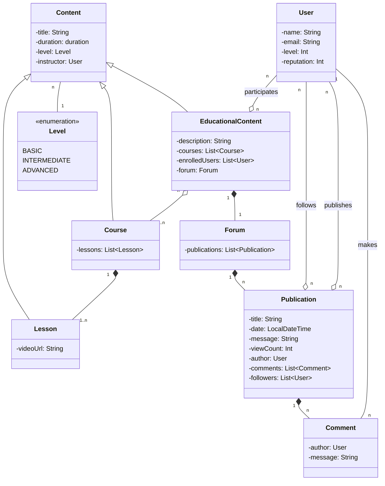

# Sistema de formações em Kotlin

## Diagrama de classes

```mermaid
classDiagram
    class User {
        -name: String
        -email: String 
        -level: Int
        -reputation: Int
    }
    class EducationalContent {
        -description: String
        -courses: List~Course~
        -enrolledUsers: List~User~
        -forum: Forum
    }
    class Course {
        -lessons: List~Lesson~
    }
    class Lesson {
        -videoUrl: String
    }
    class Forum {
        -publications: List~Publication~
    }
    class Publication {
        -title: String
        -date: LocalDateTime
        -message: String
        -viewCount: Int
        -author: User
        -comments: List~Comment~
        -followers: List~User~
    }
    class Comment {
        -author: User
        -message: String
    }
    class Level {
        <<enumeration>>
        BASIC
        INTERMEDIATE
        ADVANCED
    }

    class Content {
        -title: String
        -duration: duration
        -level: Level
        -instructor: User
    }

    Content "n"--"1" Level
    Content <|-- EducationalContent
    Content <|-- Course
    Content <|-- Lesson

    Course "1"*--"1..n" Lesson
    EducationalContent "1"*--"1" Forum
    EducationalContent "n"o--"1..n" Course
    Forum "1"*--"n" Publication
    Publication "n"o--"n" User : follows
    Publication "1"*--"n" Comment
    Comment "n"--"1" User : makes
    Publication "n"o--"n" User : publishes
    User "n"--o"n" EducationalContent : participates
    
   
```

## Tecnologias utilizadas

## Como executar o projeto

## Autor
Matheus Fernando Vieira Pinto.

https://www.linkedin.com/in/matheus-fvp/
